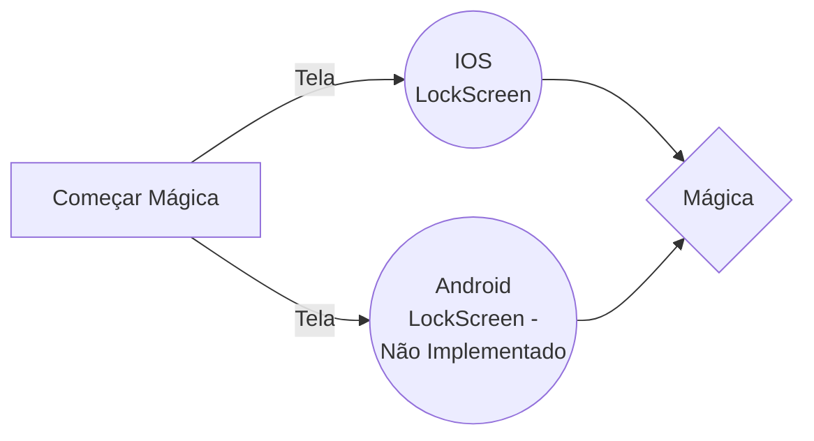

# Viagem no Tempo com Time Machine App

Prepare-se para surpreender o público com uma viagem no tempo direto do seu dispositivo móvel! Com o LockScreen App, você pode criar a ilusão de que está controlando o tempo.

## Como Funciona

A mágica começa com um simples pedido ao espectador: "Pense em um número entre 4 e 9". Enquanto o espectador está decidindo, o mágico segura o celular, mostrando a tela de bloqueio que aparenta ser a padrão de um iPhone.

Assim que o número é escolhido, o mágico toca na tela a quantidade de vezes correspondente ao número dito pelo espectador. Essas interações não parecem fazer nada no momento, mas é aqui que a mágica começa.

Sob a superfície, cada toque está definindo um estado de tempo futuro no aplicativo. O app está projetando o horário atual para frente baseado no número de toques. Se foram 5 toques, o horário pula 5 minutos para frente.

Após a série de toques, o mágico vira o telefone novamente para o espectador, mostrando o horário futuro. Por exemplo, se o horário atual era 15h00 e o número escolhido foi 5, o relógio agora marca 15h05.

O mágico então diz: "Vamos voltar no tempo", e coloca o celular na mão do espectador. Após uma breve pausa mágica, o relógio começa a contar regressivamente a cada segundo até voltar ao horário original.

## O Segredo

O segredo por trás dessa mágica é uma combinação de desenvolvimento inteligente e uma boa performance. O aplicativo é projetado para responder aos toques incrementando o horário exibido. Mas a real mágica está na apresentação. O mágico precisa criar a ilusão de que nenhum truque está sendo usado, apenas o poder da mente e do tempo.

E é claro, a "viagem no tempo" é realmente apenas uma manipulação visual do horário no app, que retorna ao horário original após um curto intervalo.

## Prepare-se para Apresentar

Antes de realizar essa mágica, pratique os seguintes passos:

- Familiarize-se com o fluxo do app e onde tocar para ativar a funcionalidade de tempo.
- Pratique a sua fala e o timing da apresentação para manter o espectador engajado.
- Certifique-se de que o dispositivo esteja com a tela sempre ativa, para evitar interrupções durante a performance.

Agora você está pronto para dobrar o tecido do tempo e deixar seu público boquiaberto com o LockScreen App!

## Stack

|Tecnologias                          |Versão|
|----------------|-------------------------------|
|React-Native  |  `0.73.5`  |            
|Expo Go  |`Versão da App Store`  |
|NodeJS  |`10.2.3`|-- is en-dash, --- is em-dash|

Caso de Uso Único

